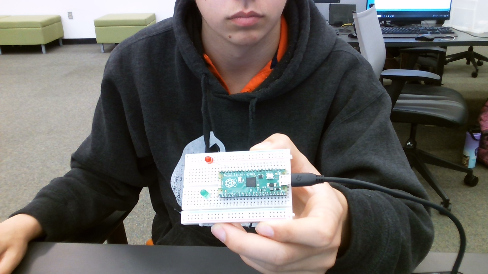
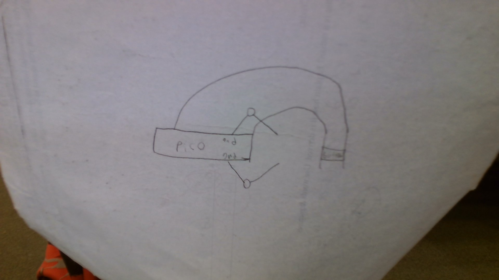
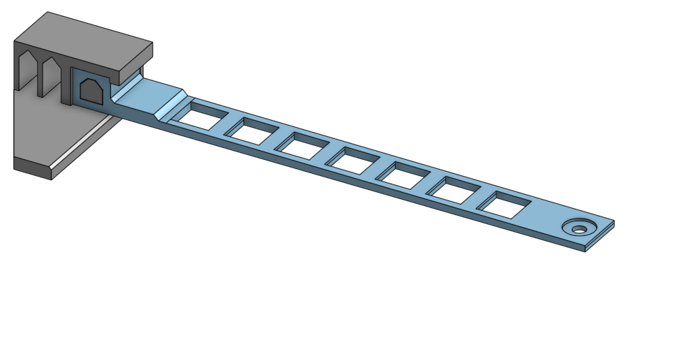
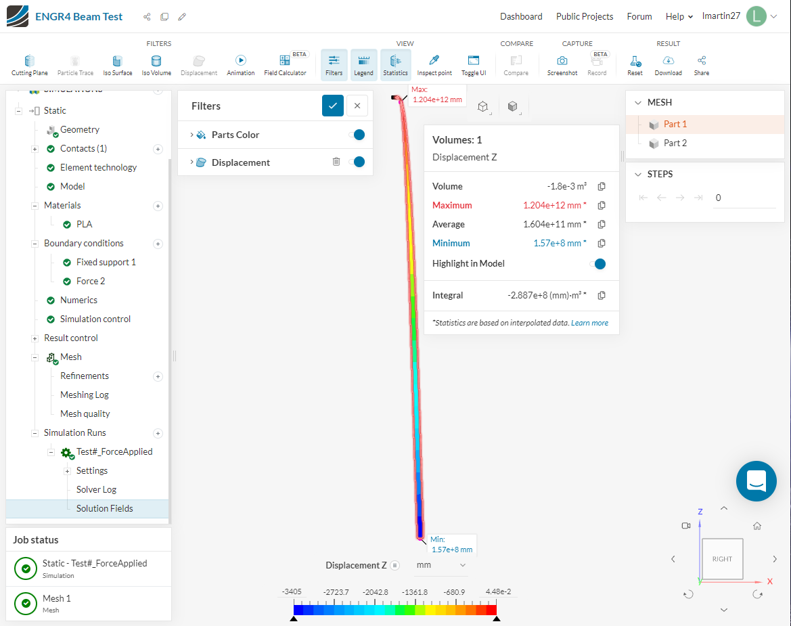
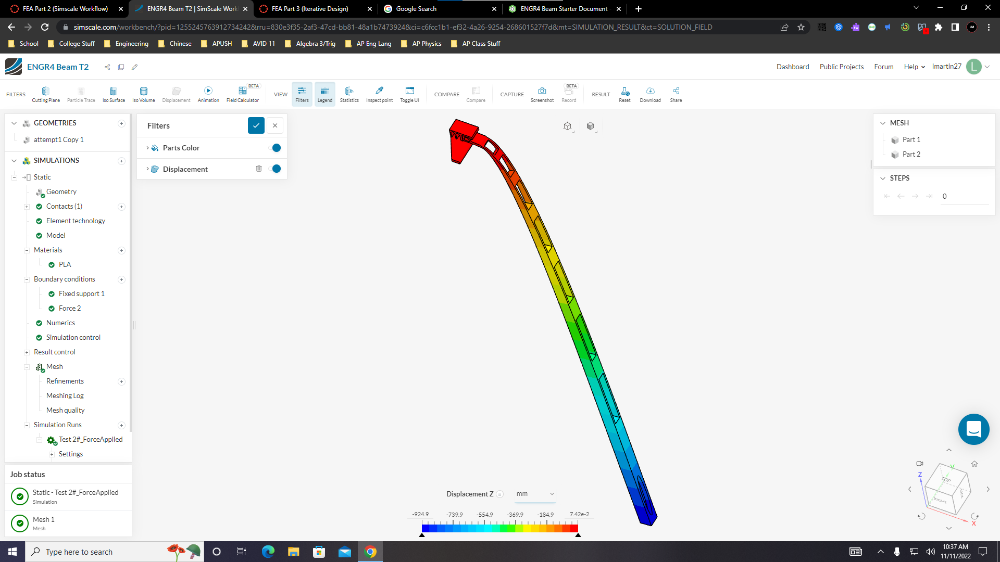
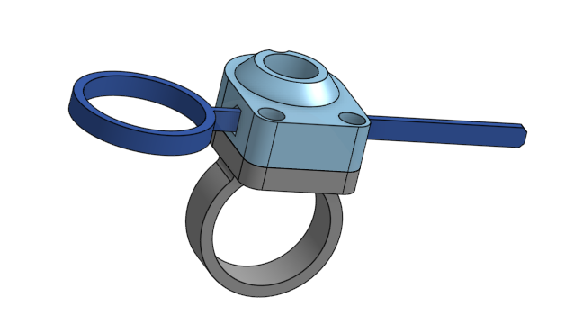
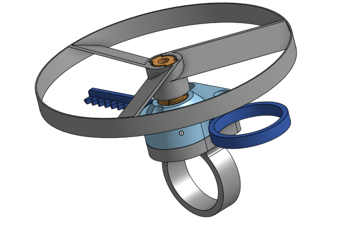
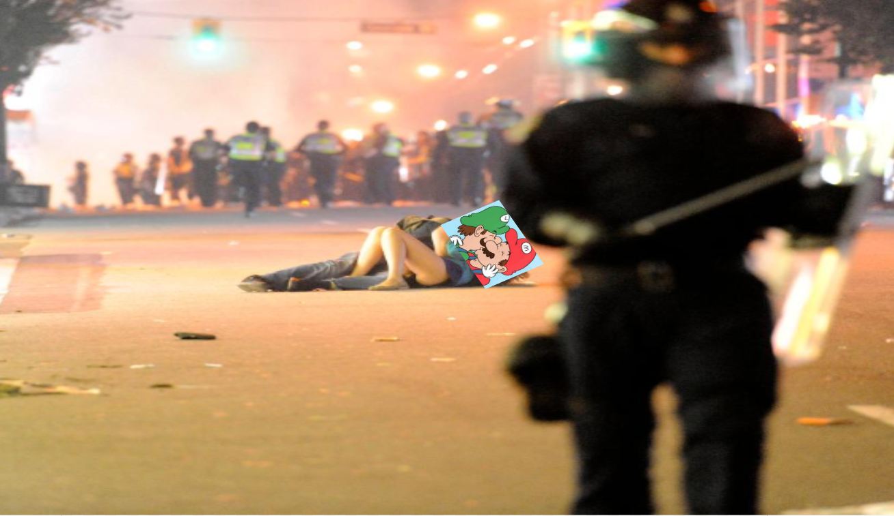

# Engineering_4_Notebook

&nbsp;

## Table of Contents
* [Launch_Pad_Part_1](#Launch_Pad_Part_1)
* [Launch_Pad_Part_2](#Launch_Pad_Part_2)
* [Launch_Pad_Part_3](#Launch_Pad_Part_3)
* [Launch_Pad_Part_4](#Launch_Pad_Part_4)
* [Crash avoidance 1](#Crash_avoidance_1)
* [Crash avoidance 2](#Crash_avoidance_2)
* [Landing Area 1](#Landing_Area_1)
* [Landing Area 2](#Landing_Area_2)
* [Morse Code 1](#Morse_Code_1)
* [Morse Code 2](#Morse_Code_2)
* [Onshape_Assignment_Template](#Onshape_Assignment_Template)
* [FEA_part1](#FEA_part1)
* [FEA_part2](#FEA_part2)
* [FEA_part3](#FEA_part3)
* [ring_and_spinner](#ring_and_spinner)
* [key_and_prop](#key_and_prop)
* [4.3_full_assembly](#full_assembly)
&nbsp;

## Launch_Pad_Part_1

### Assignment Description
make code that counts down from ten to zero and prints liftoff.

### Evidence

 

### Code
``` python
import time
for x in range (10,0,-1):  #Range from 10,0 count down -1 each second
    print(x)
    time.sleep (1)  # Second between each number
print("Takeoff!")   # print this at 0
``` 

### Reflection

pretty simple assignment and I used some online reasources (google) to learn how to countdown.

## Launch_Pad_Part_2

### Assignment Description

make a red light blink for 10 second with a countdown and then print liftoff and turn on a green light.

### Evidence 

 

### Wiring

 

### Code
``` python
import time 
import board
import digitalio 

GreenLed = digitalio.DigitalInOut(board.GP13)
GreenLed.direction = digitalio.Direction.OUTPUT 
RedLed = digitalio.DigitalInOut(board.GP18) 
RedLed.direction = digitalio.Direction.OUTPUT 

for x in range (10,0,-1):  
    GreenLed.value = True #Turns led on intially
    time.sleep(0.5) # sleep half second
    print(x) # continues  countdown
    led1.value = False #turns led off
    time.sleep(0.5) # sleep other half second
while True:
    print("Takeoff!") 
    RedLed.value = True #Red Led turns on at end of countdown
    time.sleep(0.5) # Led turns off
 ``` 

### Reflection

a good review on using leds. pretty cool easy assignment.

## Launch_Pad_Part_3

### Assignment Description

press a button that starts what we did in the previouse assignment.

### Evidence 


### Wiring



### Code
``` python
import time 
import board
import digitalio

GreenLed = digitalio.DigitalInOut(board.GP13)  
GreenLed.direction = digitalio.Direction.OUTPUT
RedLed = digitalio.DigitalInOut(board.GP18)
RedLed.direction = digitalio.Direction.OUTPUT
button = digitalio.DigitalInOut(board.GP16) 
button.direction = digitalio.Direction.INPUT # Leds are output, Button is an Input
button.pull = digitalio.Pull.UP 

while True: 
     if button.value == False: # Button initializes code
          for x in range (10,0,-1):  
    GreenLed.value = True #Turns led on intially
    time.sleep(0.5) # sleep half second
    print(x) # continues  countdown
    led1.value = False #turns led off
    time.sleep(0.5) # sleep other half second
     while True:
         print("Takeoff!") 
         RedLed.value = True #Red Led turns on at end of countdown
         time.sleep(0.5) # Led turns off
``` 

### Reflection

I had difficulty with the direction of the button but i turn it and it worked.

## Launch_Pad_Part_4

### Assignment Description

now we have the countdown with leds and a start button we add 

### Evidence 


### Wiring

This may not be applicable to all assignments. Anything where you wire something up, include the wiring diagram here. The diagram should be clear enough that I can recreate the wiring from scratch. 

### Code
``` python

servo.angle = 0

     if button.value == False: # Button initializes code
     for x in range (10,0,-1):  
     GreenLed.value = True #Turns led on intially
     time.sleep(0.5) # sleep half second
     print(x) # continues  countdown
     led1.value = False #turns led off
     time.sleep(0.5) # sleep other half second
     while True:
     print("Takeoff!") 
     RedLed.value = True #Red Led turns on at end of countdown
     time.sleep(0.5) # Led turns off
     while True:
          print("liftoff!")     #say liftoff
          led2.value = True
          servo.angle = 180  #Turn Servo from 0 degrees to 180
          time.sleep(0.5)

``` 

### Reflection


## Crash_avoidance_1


## FEA_part1

### Assignment discription

### Evidence


### Reflection


## FEA_part2

### Assignment discription

### Evidence


### Reflection


## FEA_part3

### Assignment discription

### Evidence


### Reflection

## ring_and_spinner

### Assignment discription

### Evidence


### Reflection

## key_and_prop

### Assignment discription

### Evidence


### Reflection

## full_assembly

### Assignment discription

### Evidence


### Reflection


## Media Test

Your readme will have various images and gifs on it. Upload a test image and test gif to make sure you've got the process figured out. Pick whatever image and gif you want!

### Test Link
[click here for fun supriz3 :) ](https://www.youtube.com/watch?v=dQw4w9WgXcQ)
### Test Image
 
### Test GIF
 
